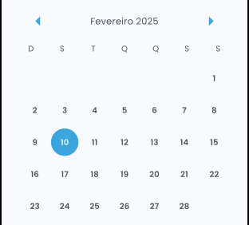
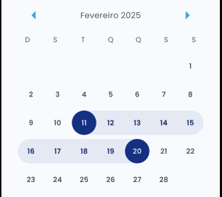

# ...Project in development...
## About
The idea of ​​this project is to provide several interface components that speed up the development of your applications.

## Features

 - **Date Picker**: A date picker component that allows you to select a date range or a single date.
## Getting started

To use this package, add `nexus_ui` as a [dependency in your pubspec.yaml file](https://flutter.dev/docs/development/packages-and-plugins/using-packages).

## Usage

### Date Picker

```dart
import 'package:nexus_ui/nexus_ui.dart';

NexusDatePicker(), 
```

Result 



#### Date Picker with range select
```dart
import 'package:nexus_ui/nexus_ui.dart';

NexusDatePicker(
  selectType: NexusCalendarSelectType.rangeSelect,
),
```

Result



#### Features


## Additional information

